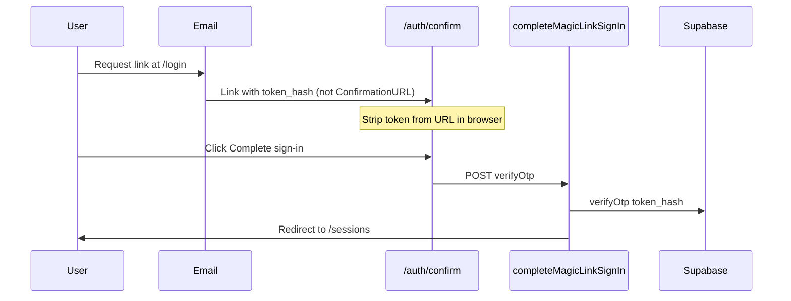

# Agent handover — ShuttleBook (Badminton booking)

Use the **block below** as the first message in a **new agent chat** (workspace root: `Badminton booking`).

---

## Paste into new agent (first message)

```
You are continuing ShuttleBook — a badminton session booking app in the "Badminton booking" monorepo.

## PRODUCT
- **Players:** magic-link sign-in at `/login`, book sessions via Stripe Checkout at `/sessions/[id]`.
- **Admins:** email + password at `/admin/login`, manage sessions and bookings at `/admin`.
- **WhatsApp (partial):** inbound webhook, BOOK/STATUS commands, Stripe checkout links (see `web/src/lib/whatsapp/`).

## PRODUCTION
- **Netlify:** https://bookbadmintonslot.netlify.app (base directory `web/`, `web/netlify.toml`)
- **GitHub:** https://github.com/ksg-spidy/Bookmyslot (branch `main`)
- **Supabase project ref:** `galtalsgxrbqapkfatky` → `https://galtalsgxrbqapkfatky.supabase.co`
- **Admin user (example):** kumarskand@gmail.com — `profiles.role = 'admin'`

## WHAT WAS DONE RECENTLY (May 2026)
1. **Admin password** — `web/scripts/set-admin-password.mjs` + `npm run set-admin-password` (service role, no email; bypasses Supabase built-in SMTP rate limits).
2. **Post-payment booking** — `fulfillBookingFromCheckoutSession` allows `locked` sessions; sync via `syncBookingAfterPayment` + Stripe webhook.
3. **Magic link URL fix** — custom email template `web/supabase/email-templates/magic-link.html` appends `&token_hash=` only after `/auth/confirm?…` (fallback when `RedirectTo` is site root only).
4. **Magic link prefetch fix (committed `16b71b4`, on `main`)** — `/auth/confirm` no longer exposes `/auth/callback?token_hash=…` in HTML. Verification via POST `completeMagicLinkSignIn` + **Complete sign-in**; token stripped from URL with `history.replaceState`.
5. **Supabase apply script** — `web/scripts/apply-supabase-auth-config.mjs` + `npm run apply-supabase-auth` (needs `SUPABASE_ACCESS_TOKEN` in `.env.local` from https://supabase.com/dashboard/account/tokens).

## PRODUCTION OPS (if magic link or booking still broken)
- **Netlify:** `main` auto-deploys; confirm latest deploy after `16b71b4`.
- **Supabase:** Re-paste `magic-link.html` + redirect URLs, or run `npm run apply-supabase-auth` with `SUPABASE_ACCESS_TOKEN`.
- **Fresh magic link:** After template/redirect fixes, users must request a **new** link (old OTPs may already be consumed).

## KNOWN PRODUCTION ISSUES & FIXES

### A. `play_session_lookup:Invalid API key` after Stripe payment
- **Cause:** Netlify missing/wrong `SUPABASE_SERVICE_ROLE_KEY` (or URL/key from different projects).
- **Fix:** Netlify env vars: `NEXT_PUBLIC_SUPABASE_URL`, `NEXT_PUBLIC_SUPABASE_ANON_KEY`, `SUPABASE_SERVICE_ROLE_KEY` (service_role, not anon). Redeploy. Player clicks "Retry save booking" on session page.

### B. Magic link `otp_expired` / invalid URL
- **Invalid URL** (`…netlify.app&token_hash=…`): Supabase **Redirect URLs** missing `/auth/confirm**` → `emailRedirectTo` ignored; update template from repo + add redirect URLs.
- **otp_expired before user clicks:** (1) Dashboard still using default template with `{{ .ConfirmationURL }}` (verifies on GET). (2) Pre-`16b71b4` confirm page exposed `/auth/callback?token_hash=` in HTML (fixed in app). (3) Email scanner consumed link — user must request **new** link after fixes.
- **Supabase checklist:**
  - Site URL: `https://bookbadmintonslot.netlify.app`
  - Redirect URLs: `https://bookbadmintonslot.netlify.app/auth/confirm**`, `…/auth/callback**`, `http://localhost:3000/auth/confirm**`, etc.
  - Email template: paste `web/supabase/email-templates/magic-link.html` + subject from `magic-link-subject.txt`
  - Or: `SUPABASE_ACCESS_TOKEN` in `.env.local` → `cd web && npm run apply-supabase-auth`

### C. Admin password reset rate limit
- Use `npm run set-admin-password -- email@example.com 'password'` (min 8 chars), not Supabase dashboard "Send recovery".

## KEY PATHS
| Area | Path |
|------|------|
| Next app | `web/` |
| Build | `cd web && npm run build` |
| Player login | `web/src/app/login/page.tsx` |
| Magic confirm | `web/src/app/auth/confirm/page.tsx` |
| Auth callback (PKCE/code) | `web/src/app/auth/callback/route.ts` |
| Confirm URL builder | `web/src/lib/authConfirmUrl.ts` |
| Booking fulfillment | `web/src/lib/checkout/fulfillBooking.ts` |
| Post-checkout sync | `web/src/app/actions/syncBooking.ts` |
| Stripe webhook | `web/src/app/api/webhooks/stripe/route.ts` |
| WhatsApp webhook | `web/src/app/api/webhooks/whatsapp/route.ts` |
| Migrations | `web/supabase/migrations/001_initial.sql` … `005_*.sql` |
| Env template | `web/.env.local.example` |
| Setup README | `web/README.md` |

## DEV SCRIPTS (`web/scripts/`)
- `set-admin-password.mjs` — admin password + role
- `apply-supabase-auth-config.mjs` — Management API: template + redirect URLs
- `magic-link.mjs` — generate test confirm URL: `node scripts/magic-link.mjs email /sessions http://localhost:3000`
- `list-admins.mjs`, `e2e-setup.mjs`, `test-fulfill*.mjs`

## NETLIFY ENV (production — verify all set)
- `NEXT_PUBLIC_SUPABASE_URL`, `NEXT_PUBLIC_SUPABASE_ANON_KEY`, `SUPABASE_SERVICE_ROLE_KEY`
- `NEXT_PUBLIC_SITE_URL` = `https://bookbadmintonslot.netlify.app` (no trailing slash)
- `STRIPE_SECRET_KEY`, `STRIPE_WEBHOOK_SECRET`, `STRIPE_CURRENCY` (optional)
- WhatsApp vars if enabled (see `.env.local.example`)

## CONSTRAINTS
- Small focused diffs; match existing patterns.
- Run `npm run build` in `web/` after substantive changes.
- Never commit `.env.local` or secrets.
- Only commit when user asks.

## SUGGESTED NEXT STEPS (if user doesn’t specify)
1. Verify production magic link with a **fresh** email (post-`16b71b4` deploy + Supabase template/redirect URLs).
2. Run `npm run apply-supabase-auth` (or manual Supabase dashboard) if magic links still broken.
3. Verify Netlify `SUPABASE_SERVICE_ROLE_KEY` if bookings fail after payment.
4. Continue WhatsApp product work per `docs/BUILD_WHATSAPP_KICKOFF.md` (confirm `002_whatsapp.sql` applied).

Start by checking which production issue the user reports (magic link, booking save, admin, WhatsApp).
```

---

## Quick reference

| Item | Value |
|------|--------|
| Production URL | https://bookbadmintonslot.netlify.app |
| Supabase ref | `galtalsgxrbqapkfatky` |
| Repo | `ksg-spidy/Bookmyslot` |
| Player auth | Magic link → `/auth/confirm` → POST verify |
| Admin auth | `/admin/login` (email + password) |
| Stripe webhook | `/api/webhooks/stripe` |
| WhatsApp webhook | `/api/webhooks/whatsapp` |

## Auth flow (current design)



**Do not** put `token_hash` in a static `<a href="/auth/callback?...">` on the confirm page — scanners prefetch it and burn the OTP.

## Migration order (Supabase SQL Editor)

1. `001_initial.sql`
2. `002_whatsapp.sql` (if using WhatsApp)
3. `003_whatsapp_link_tokens.sql`
4. `004_booking_unique_active_only.sql`
5. `005_bookings_rebook_after_withdraw.sql`

If runtime errors mention missing tables/columns, a migration was not applied on the linked project.
