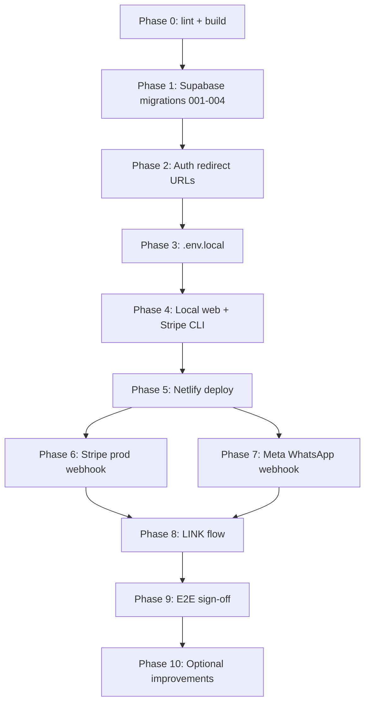

# ShuttleBook — implementation guide (go-live)

Use this document as the **ordered runbook** to take ShuttleBook from “code in repo” to **production-ready** (web app + WhatsApp + Stripe + Supabase). Each phase ends with a **Done when** gate before you move on.

**Repo layout:** Next.js app lives in `web/`. Deploy target: **Netlify** (`web/netlify.toml`). More dev detail: `web/README.md`.

---

## What you are implementing

| Surface | Purpose |
|---------|---------|
| **Web app** | Magic-link auth, player booking via Stripe Checkout, admin sessions & CSV export |
| **WhatsApp** | HELP / BOOK / STATUS / ROSTER / WITHDRAW / LINK — inbound webhook + Stripe payment links |
| **Stripe** | Checkout + webhooks (`checkout.session.completed`) for web and WhatsApp bookings |
| **Supabase** | Postgres schema, RLS, auth, `whatsapp_identities`, link tokens |

**Already verified in repo (no live credentials):** `npm run lint`, `npm run build`, and TypeScript compile all pass. WhatsApp / Stripe / Supabase behaviour still needs your accounts and the steps below.

---

## Prerequisites (gather before Phase 1)

- [ ] **Node.js 20+** and npm (local dev)
- [ ] **Supabase** project ([supabase.com](https://supabase.com))
- [ ] **Stripe** account — start in **test mode**
- [ ] **Meta Developer** app with **WhatsApp Cloud API** and a test or production phone number
- [ ] **Netlify** site (connected to this repo or manual deploys)
- [ ] Optional for local webhook testing: **Stripe CLI**, **ngrok** (or similar tunnel) for WhatsApp/Stripe callbacks to `localhost`

---

## Phase 0 — Local toolchain

**Goal:** Confirm the app builds on your machine.

1. Open a terminal in `web/`:
   ```bash
   cd web
   npm install
   npm run lint
   npm run build
   ```
2. All three commands should exit **0**.

**Done when:** Lint and build pass with no errors.

---

## Phase 1 — Supabase database

**Goal:** Schema matches the code (including WhatsApp and rebook-after-withdraw).

### 1.1 Create project (if greenfield)

1. Create a Supabase project and note **Project URL** and **API keys** (Settings → API).

### 1.2 Run migrations **in order**

In Supabase **SQL Editor**, run each file from `web/supabase/migrations/` **once**, in this order:

| Order | File | When |
|-------|------|------|
| 1 | `001_initial.sql` | New database only |
| 2 | `002_whatsapp.sql` | Always (WhatsApp tables + booking columns) |
| 3 | `003_whatsapp_link_tokens.sql` | Always (LINK flow) |
| 4 | `004_booking_unique_active_only.sql` | **Required** — partial unique indexes so a player can **BOOK again after WITHDRAW** |

> **If you skip 004:** rebooking after WITHDRAW can hit unique constraint errors or silent webhook early-returns.

### 1.3 Promote your user to admin

1. **Authentication → Sign up** with your email (magic link).
2. **Authentication → Users** → copy your user UUID.
3. Run:
   ```sql
   update public.profiles set role = 'admin' where id = 'YOUR-USER-UUID';
   ```

### 1.4 Verify WhatsApp schema

1. Open `web/supabase/ops/verify_whatsapp_schema.sql` in SQL Editor and run it.
2. Every result row should show **`ok = true`**.
3. If anything fails, check **Table editor → bookings → indexes**:  
   `bookings_play_session_wa_unique` and `bookings_play_session_user_unique` should only include rows with  
   `status in ('confirmed','waitlist','pending_payment')` (see migration 004).

**Done when:** Migrations applied, admin role set, `verify_whatsapp_schema.sql` all `ok`.

---

## Phase 2 — Supabase Auth URLs

**Goal:** Magic link and LINK callback work in dev and production.

1. **Authentication → URL configuration**
2. **Site URL:**  
   - Dev: `http://localhost:3000`  
   - Prod: `https://your-site.netlify.app` (your real Netlify URL)
3. **Redirect URLs** — add (wildcard `https://your-site.netlify.app/**` is fine):
   - `http://localhost:3000/auth/callback`
   - `http://localhost:3000/auth/confirm`
   - `https://your-site.netlify.app/auth/callback`
   - `https://your-site.netlify.app/auth/confirm`

**Done when:** Callback and confirm paths are allowed (adjust host if you use a custom domain).

---

## Phase 2b — Magic-link email template (recommended)

**Goal:** Sign-in emails name ShuttleBook, explain why the link was sent, and describe what happens on click.

1. **Authentication → Email Templates → Magic Link**
2. **Subject:** paste `web/supabase/email-templates/magic-link-subject.txt` (one line).
3. **Body:** paste `web/supabase/email-templates/magic-link.html` (HTML source mode).
4. **Save**
5. Optional: **Authentication → Providers → Email** — confirm **OTP expiry** is `3600` (1 hour) or update the template and `/login` copy to match.

**Done when:** A test magic link email shows the ShuttleBook subject, green CTA button, “what happens” bullets, and expiry/security text.

---

## Phase 2c — Returning players (session persistence)

**Goal:** Players who signed in once can book again on the same phone/browser without a new magic link.

1. Deploy app code that redirects `/login` when a session cookie exists and shows “Already signed in” / “Try sessions first” copy.
2. Supabase → **Authentication → Sessions** — avoid aggressive **inactivity** / **time-box** limits (Pro); on free tier, defaults usually allow long-lived refresh sessions.
3. Optional: **Authentication → Settings** → raise **JWT expiry** if players report frequent logouts.
4. Test: sign in once → close tab → reopen `https://your-site.netlify.app/sessions` → should still be signed in.

**Done when:** Second visit on the same browser reaches sessions without a new email (until Sign out).

---

## Phase 3 — Environment variables (local)

**Goal:** `web/.env.local` has everything the server needs.

1. Copy `web/.env.local.example` → `web/.env.local`.
2. Fill in every row below (no trailing slash on `NEXT_PUBLIC_SITE_URL`):

| Variable | Source |
|----------|--------|
| `NEXT_PUBLIC_SUPABASE_URL` | Supabase → Settings → API |
| `NEXT_PUBLIC_SUPABASE_ANON_KEY` | Same |
| `SUPABASE_SERVICE_ROLE_KEY` | Same (**server only** — never expose to browser) |
| `NEXT_PUBLIC_SITE_URL` | `http://localhost:3000` for local dev |
| `STRIPE_SECRET_KEY` | Stripe → Developers → API keys (Secret key) |
| `STRIPE_WEBHOOK_SECRET` | Phase 4 (local CLI) or Phase 6 (production endpoint) |
| `STRIPE_CURRENCY` | Optional, default `aud` |
| `BOOKING_TZ_OFFSET` | Optional, e.g. `+10:00` (AEST) |
| `WHATSAPP_VERIFY_TOKEN` | You choose — must match Meta webhook config later |
| `WHATSAPP_APP_SECRET` | Meta App → WhatsApp → App Secret |
| `WHATSAPP_ACCESS_TOKEN` | Meta permanent or system user token |
| `WHATSAPP_PHONE_NUMBER_ID` | Meta WhatsApp phone number ID |
| `WHATSAPP_DEFAULT_PLAY_SESSION_ID` | Optional UUID for predictable BOOK/STATUS default session |

**Done when:** `.env.local` exists and is complete; file is **not** committed to git.

---

## Phase 4 — Local web app smoke test

**Goal:** Web booking works before WhatsApp or production deploy.

1. Start dev server:
   ```bash
   cd web
   npm run dev
   ```
2. Open [http://localhost:3000](http://localhost:3000).
3. Sign in with magic link (admin user).
4. **Admin:** create a play session.
5. **Player:** sign in as a second user (or incognito), open session, complete Stripe Checkout (test card).
6. Optional: set **Profile** (`/sessions/settings`) — name and phone for admin CSV.

### 4.1 Stripe webhook (local)

1. Install [Stripe CLI](https://stripe.com/docs/stripe-cli).
2. Forward events to your app:
   ```bash
   stripe listen --forward-to localhost:3000/api/webhooks/stripe
   ```
3. Copy the CLI **webhook signing secret** into `STRIPE_WEBHOOK_SECRET` in `.env.local`.
4. Subscribe to event: **`checkout.session.completed`** (Dashboard endpoint uses the same event in Phase 6).

**Done when:** A web booking appears in Supabase `bookings` after successful test payment.

---

## Phase 5 — Netlify production deploy

**Goal:** Public HTTPS URL for Stripe, Meta, and `NEXT_PUBLIC_SITE_URL`.

1. Create or connect a Netlify site to this repository.
2. **Base directory:** `web` (if repo root is `Badminton booking`).
3. Build command: `npm run build` (already in `netlify.toml`).
4. Plugin: `@netlify/plugin-nextjs` (in `web/package.json` devDependencies).
5. Deploy once; note production URL, e.g. `https://your-site.netlify.app`.
6. In Netlify **Site configuration → Environment variables**, add **the same keys** as `.env.local`, with:
   - `NEXT_PUBLIC_SITE_URL` = production origin (**no trailing slash**)
   - Production Supabase and Stripe keys when you go live (test keys are fine for first deploy)
7. Trigger a **redeploy** after env changes.

**Done when:** Production site loads over HTTPS and build succeeds.

---

## Phase 6 — Stripe production webhook

**Goal:** Hosted app receives `checkout.session.completed` (web + WhatsApp metadata).

1. Stripe Dashboard → **Developers → Webhooks → Add endpoint**
2. URL: `https://<YOUR_DOMAIN>/api/webhooks/stripe`
3. Event: **`checkout.session.completed`**
4. Copy **signing secret** → Netlify `STRIPE_WEBHOOK_SECRET` (and local if testing against prod).
5. Redeploy Netlify if you changed secrets.

### 6.1 Stripe QA scenarios (test mode)

| Scenario | What to verify |
|----------|----------------|
| WhatsApp BOOK → pay | `bookings` row; optional WhatsApp confirmation text |
| Session full | Payment succeeds, status `waitlist`, message copy correct |
| WITHDRAW | Refund ≈ `booking_fee_cents - withdrawal_fee_cents`; status `withdrawn`; waitlist promotion if applicable |
| Idempotency | Replay same `checkout.session.completed` (Stripe CLI) — no duplicate booking or duplicate WhatsApp spam |

**Done when:** Test Checkout from production URL updates DB; webhook delivery shows **200** in Stripe.

---

## Phase 7 — Meta WhatsApp Cloud API

**Goal:** Inbound messages reach `web/src/app/api/webhooks/whatsapp/route.ts`.

1. Meta App Dashboard → **WhatsApp → Configuration**
2. **Callback URL:** `https://<YOUR_DOMAIN>/api/webhooks/whatsapp`
3. **Verify token:** same string as `WHATSAPP_VERIFY_TOKEN` in Netlify
4. **App Secret:** same as `WHATSAPP_APP_SECRET` (validates `X-Hub-Signature-256`)
5. Subscribe to **`messages`** (and **`contacts`** if available — code uses `contacts[0].profile.name`)
6. Confirm **Phone number ID** and **access token** match env (test vs prod numbers differ)
7. Save; Meta sends GET challenge — should return **200** (check Netlify function logs)

### 7.1 WhatsApp command smoke (real device)

Send from a test phone to your business number:

| Step | Command | Expect |
|------|---------|--------|
| 1 | **HELP** | Menu (buttons or text fallback) |
| 2 | **BOOK** | Stripe Checkout link in chat → pay test card |
| 3 | **ROSTER** | Sensible player list (confirmed, then waitlist by position) |
| 4 | **WITHDRAW** | Confirm → refund in Stripe Dashboard + DB `withdrawn` |
| 5 | **BOOK** again (same session) | Succeeds only if migration **004** + current code are deployed |
| 6 | **STATUS** | Session/booking summary for default or linked session |

**Done when:** Server logs show **200** for inbound messages; BOOK flow creates booking after payment.

---

## Phase 8 — Supabase Auth LINK flow (WhatsApp ↔ profile)

**Goal:** WhatsApp user can link to a Supabase profile for cross-channel identity.

1. Confirm production origin is in **Redirect URLs** (Phase 2).
2. On WhatsApp, send **LINK** → open URL in browser.
3. Complete **login** (email OTP / magic link) → lands on `/auth/callback?next=...` → `/whatsapp/link?t=...`.
4. In DB, confirm `whatsapp_identities.profile_id` is set for that `wa_id`.
5. Confirm **RLS:** `whatsapp_profile_link_tokens` has no broad client policies (service role only) — expected.

**Done when:** LINK completes without error and profile is linked in Supabase.

---

## Phase 9 — End-to-end go-live checklist

Run this **once** after Phases 1–8. Treat it as your final sign-off.

- [ ] SQL: `verify_whatsapp_schema.sql` — all `ok`
- [ ] Meta: webhook GET challenge succeeds
- [ ] Env: `NEXT_PUBLIC_SITE_URL` matches Stripe success/cancel URLs and WhatsApp LINK URLs (no slash mismatch)
- [ ] WhatsApp: HELP → BOOK → pay → confirmation
- [ ] WhatsApp: ROSTER sane
- [ ] WhatsApp: WITHDRAW → Stripe refund + `withdrawn`
- [ ] WhatsApp: BOOK again after WITHDRAW (needs migration **004**)
- [ ] WhatsApp: LINK → browser auth → `profile_id` set
- [ ] Web: admin session + player Checkout still works on production URL
- [ ] Netlify logs: no recurring 4xx/5xx on `/api/webhooks/stripe` or `/api/webhooks/whatsapp`

**Done when:** All boxes checked on production (test mode is acceptable for first launch).

---

## Phase 10 — Post-launch improvements (optional)

These are **not** blockers for go-live; track them after Phase 9.

### Product / UX gaps

- [ ] **Web parity:** `ShuttleBook_Player_Preview.html` shows court assignment — app does not; align copy or implement courts
- [ ] **Stripe:** only `checkout.session.completed` today — no `charge.refunded`, disputes, or expired checkout cleanup for `pending_payment`
- [ ] **WhatsApp:** inbound only handles `value.messages[]` — statuses/errors/templates ignored by design
- [ ] **i18n:** English-only; WITHDRAW uses `$` regardless of `STRIPE_CURRENCY`
- [ ] **Security:** rate limits / WAF on public webhooks if abused
- [ ] **Observability:** Netlify logs; optional Sentry/Datadog

### Engineering follow-ups

- [ ] **Vitest / Playwright:** HMAC verify, `safeInternalPath`, mocked Stripe webhook
- [ ] Migrate off deprecated `next lint` on Next.js 16 upgrade
- [ ] Scheduled cleanup of expired `whatsapp_profile_link_tokens`
- [ ] Admin UI for `whatsapp_identities` and linked profiles

---

## Quick reference — key paths

| Area | Path |
|------|------|
| WhatsApp webhook | `web/src/app/api/webhooks/whatsapp/route.ts` |
| Stripe webhook | `web/src/app/api/webhooks/stripe/route.ts` |
| Inbound commands | `web/src/lib/whatsapp/processInbound.ts` |
| Roster / withdraw | `web/src/lib/whatsapp/waBookingOps.ts` |
| Interactive send | `web/src/lib/whatsapp/sendInteractiveButtons.ts` |
| Schema verify | `web/supabase/ops/verify_whatsapp_schema.sql` |
| Migrations | `web/supabase/migrations/*.sql` |
| Env template | `web/.env.local.example` |
| Web README | `web/README.md` |
| Agent / recovery context | `docs/AGENT_HANDOVER.md`, `docs/BUILD_WHATSAPP_KICKOFF.md` |

---

## Implementation flow (at a glance)



---

*Last aligned with repo recheck: lint/build pass; migrations through `004_booking_unique_active_only.sql`.*
